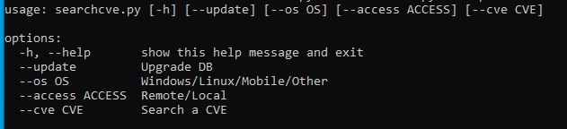
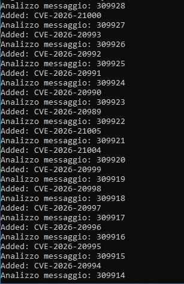
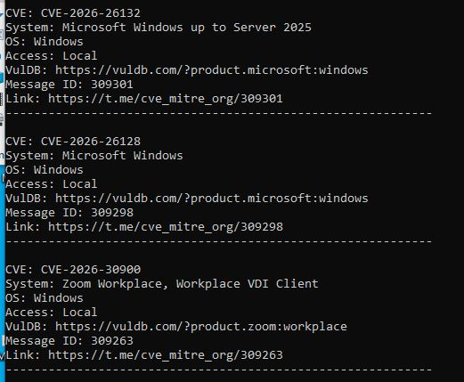

# SearchCVE
A powerful searchsploit successor :) supercharged with full MITRE coverage. Created by pentesters, for pentesters.


### Description

Automated tool for scraping and cataloging CVE (Common Vulnerabilities and Exposures) from the Telegram channel [@cve_mitre_org](https://t.me/cve_mitre_org). The tool creates a local SQLite database with classified vulnerability information for quick searching and analysis.

### Features

- **Automatic scraping** from Telegram channel
- **Local SQLite database** for offline access
- **Automatic classification** by:
  - Operating System (Windows/Linux/Mobile/Other)
  - Access Type (Remote/Local/Unknown)
  - Affected System/Product
- **VulDB integration** - extracts VulDB links when available
- **Advanced search** by CVE, OS, access type, or product



### Requirements

```bash
pip install telethon
```

**System requirements:**
- Python 3.7+
- SQLite3 (included in Python)

### Installation

1. Clone or download the script

2. Install dependencies:
```bash
pip install telethon
```

3. Get Telegram API credentials:
   - Visit https://my.telegram.org/auth
   - Login with your phone number
   - Go to "API development tools"
   - Create an application
   - Copy `api_id` and `api_hash`

4. Edit the script and insert your credentials:
```python
api_id = YOUR_API_ID        # Replace with your api_id
api_hash = "YOUR_API_HASH"  # Replace with your api_hash
```

### Usage

#### First Time Setup - Create Database

```bash
python searchcve.py --update
```

This will:
- Create the SQLite database (`cve_database.db`)
- Fetch all messages from the Telegram channel
- Extract and classify CVEs
- Store them in the database

**Note:** First run requires Telegram authentication (you'll receive a code via Telegram / Ex. telephone number format: +39 xxx xxxxxxx)


#### Update Database with New CVEs

```bash
python searchcve.py --update
```


#### Search CVEs

**Search by Operating System:**
```bash
python searchcve.py --os Windows
python searchcve.py --os Linux
```

**Search by Access Type:**
```bash
python searchcve.py --access Remote
python searchcve.py --access Local
```

**Search specific CVE:**
```bash
python searchcve.py --cve CVE-2024-1234
```

**Search by Product/System:**
```bash
python searchcve.py --system "Apache"
python searchcve.py --system "WordPress"
python searchcve.py --system "Kernel"
```

**Combine filters:**
```bash
python searchcve.py --os Linux --access Remote
python searchcve.py --os Windows --system "Microsoft"
```

### 📂 Example Output

```
CVE: CVE-2024-1234
System: Apache HTTP Server
OS: Linux
Access: Remote
VulDB: https://vuldb.com/?id.123456
Message ID: 98765
Link: https://t.me/cve_mitre_org/98765
------------------------------------------------------------
```


